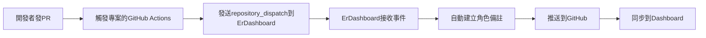

# 🤖 開發活動自動備註設定指南

當開發者進行各種開發活動時，自動在 ErDashboard 建立角色備註。

## 🎯 功能

- ✅ **PR 活動**: 偵測 PR 建立、ready for review、合併
- ✅ **Push 活動**: 偵測推送到主要分支 (main, master, develop)
- ✅ **Feat 提交**: 自動識別 feat: 開頭的功能提交
- ✅ **智能對應**: 自動對應專案名稱和開發者
- ✅ **多種格式**: 根據活動類型生成不同的備註格式
- ✅ **完全自動化**: 無需手動操作

## 📋 設定步驟

### 1. 在你的專案倉庫中設定

複製模板檔案：
```bash
# 從 ErDashboard 複製模板
cp .github/workflows/TEMPLATE-auto-pr-note.yml 你的專案/.github/workflows/auto-pr-note.yml
```

### 2. 調整專案名稱對應（可選）

編輯 `auto-pr-note.yml` 的專案名稱對應邏輯：

```yaml
case "${REPO_NAME}" in
  *[Cc]ore*) PROJECT_NAME="ErCore" ;;
  *[Nn]exus*) PROJECT_NAME="ErNexus" ;;
  # ... 其他對應
  *你的專案關鍵字*) PROJECT_NAME="你的ErDashboard專案名稱" ;;
esac
```

### 3. 設定開發者對應

在 ErDashboard 的 `scripts/submit-pr-note.js` 中新增 GitHub 用戶名對應：

```javascript
const userMapping = {
    'mingxianliu': 'KlauderA',
    '你的github用戶名': '你的成員名稱',
    // 加入更多對應
};
```

## 🚀 運作流程



## 📝 備註格式

根據不同的開發活動自動生成不同格式的備註：

### PR 活動
```
📋 • PR #123: 修復登入bug
```

### PR 合併
```
🎉 • Merged: 修復登入bug
```

### Feat 提交
```
✨ • 新功能: 用戶管理功能
```

### 一般推送
```
🔨 • 更新文檔
```

## 🔧 進階設定

### 自訂備註內容

修改 `scripts/submit-dev-note.js` 中的備註格式：

```javascript
case 'feat':
    emoji = '✨';
    noteContent = `• 新功能: ${cleanTitle}`;
    break;
// 自訂為更詳細的格式
case 'feat':
    emoji = '✨';
    noteContent = `• 新功能: ${cleanTitle} (${projectName})`;
    break;
```

### 過濾特定活動

在模板中加入條件判斷：

```yaml
- name: 檢查是否需要備註
  if: |
    !(
      contains(github.event.pull_request.title, '[skip-note]') ||
      contains(github.event.head_commit.message, '[skip-note]')
    )
```

### 只監控特定分支

```yaml
on:
  push:
    branches: [main, develop]  # 只監控這些分支
```

### 只監控特定 commit 類型

```yaml
- name: 檢查 commit 類型
  if: |
    startsWith(github.event.head_commit.message, 'feat:') ||
    startsWith(github.event.head_commit.message, 'fix:') ||
    startsWith(github.event.head_commit.message, 'docs:')
```

## 🧪 測試

1. 在你的專案中建立測試 PR
2. 確認 GitHub Actions 正常執行
3. 檢查 ErDashboard 是否收到角色備註

## ❗ 注意事項

- 需要 GitHub Actions 權限
- 第一次設定可能需要調整專案名稱對應
- 確保 GitHub 用戶名在成員對應表中

## 🐛 疑難排解

### Q: 沒有收到自動備註？
1. 檢查 GitHub Actions 執行記錄
2. 確認專案名稱對應正確
3. 檢查開發者名稱對應

### Q: 備註格式不對？
修改 `submit-pr-note.js` 中的格式設定

### Q: 權限問題？
確認 GitHub Actions 有適當的權限設定

## 📞 支援

如有問題，請在 ErDashboard 建立 Issue 或聯繫團隊。