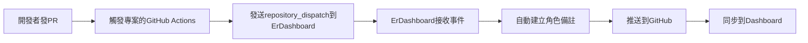

# 🤖 PR 自動備註設定指南

當開發者發 PR 時，自動在 ErDashboard 建立角色備註。

## 🎯 功能

- ✅ 偵測 PR 建立和 ready for review 事件
- ✅ 自動對應專案名稱和開發者
- ✅ 建立格式化的角色備註
- ✅ 無需手動操作，完全自動化

## 📋 設定步驟

### 1. 在你的專案倉庫中設定

複製模板檔案：
```bash
# 從 ErDashboard 複製模板
cp .github/workflows/TEMPLATE-auto-pr-note.yml 你的專案/.github/workflows/auto-pr-note.yml
```

### 2. 調整專案名稱對應（可選）

編輯 `auto-pr-note.yml` 的專案名稱對應邏輯：

```yaml
case "${REPO_NAME}" in
  *[Cc]ore*) PROJECT_NAME="ErCore" ;;
  *[Nn]exus*) PROJECT_NAME="ErNexus" ;;
  # ... 其他對應
  *你的專案關鍵字*) PROJECT_NAME="你的ErDashboard專案名稱" ;;
esac
```

### 3. 設定開發者對應

在 ErDashboard 的 `scripts/submit-pr-note.js` 中新增 GitHub 用戶名對應：

```javascript
const userMapping = {
    'mingxianliu': 'KlauderA',
    '你的github用戶名': '你的成員名稱',
    // 加入更多對應
};
```

## 🚀 運作流程



## 📝 備註格式

自動生成的備註格式：
```
• PR #123: 修復登入bug的標題
```

## 🔧 進階設定

### 自訂備註內容

修改 `scripts/submit-pr-note.js` 中的備註格式：

```javascript
const noteContent = `• PR #${prNumber}: ${prTitle}`;
// 改為更詳細的格式
const noteContent = `• PR #${prNumber}: ${prTitle} (來自 ${projectName})`;
```

### 過濾特定 PR

在模板中加入條件判斷：

```yaml
- name: 檢查是否需要備註
  if: "!contains(github.event.pull_request.title, '[skip-note]')"
```

## 🧪 測試

1. 在你的專案中建立測試 PR
2. 確認 GitHub Actions 正常執行
3. 檢查 ErDashboard 是否收到角色備註

## ❗ 注意事項

- 需要 GitHub Actions 權限
- 第一次設定可能需要調整專案名稱對應
- 確保 GitHub 用戶名在成員對應表中

## 🐛 疑難排解

### Q: 沒有收到自動備註？
1. 檢查 GitHub Actions 執行記錄
2. 確認專案名稱對應正確
3. 檢查開發者名稱對應

### Q: 備註格式不對？
修改 `submit-pr-note.js` 中的格式設定

### Q: 權限問題？
確認 GitHub Actions 有適當的權限設定

## 📞 支援

如有問題，請在 ErDashboard 建立 Issue 或聯繫團隊。