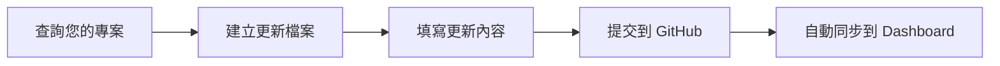

# ErDashboard 更新指南

## 📚 目錄
1. [快速開始](#快速開始)
2. [更新流程](#更新流程)
3. [使用 GitHub Web 介面更新](#使用-github-web-介面更新)
4. [使用 Git 命令更新](#使用-git-命令更新)
5. [常見問題](#常見問題)

---

## 快速開始

### 您需要知道的三件事
1. **您的員工編號** (如 A-CC, B-CA)
2. **您負責的專案** (查看 [成員專案對照表](./member-projects-index.md))
3. **今天的日期** (用於檔案命名)

### 三步驟完成更新
1. 📋 **查詢** - 在 [成員專案對照表](./member-projects-index.md) 找到您的專案
2. 📝 **填寫** - 使用 [更新模板](./templates/project-update-template.md) 建立更新檔案
3. 💾 **提交** - 上傳到對應的專案資料夾

---

## 更新流程



### Step 1: 查詢您的專案
1. 開啟 [成員專案對照表](./member-projects-index.md)
2. 使用 `Ctrl+F` 搜尋您的名字
3. 記下您的專案 ID 和更新路徑

### Step 2: 建立更新檔案
1. 複製 [專案更新模板](./templates/project-update-template.md)
2. 檔案命名：`YYYY-MM-DD-update.json`
   - 範例：`2025-01-18-update.json`

### Step 3: 填寫更新內容
必填欄位：
- `date` - 更新日期
- `updatedBy` - 您的名字
- `memberId` - 您的員工編號
- `projectId` - 專案 ID
- `overallProgress` - 整體進度百分比

選填欄位：
- `blockers` - 遇到的問題
- `notes` - 其他備註

### Step 4: 提交更新
選擇以下任一方式：
- [GitHub Web 介面](#使用-github-web-介面更新)（推薦新手）
- [Git 命令](#使用-git-命令更新)（開發者）

---

## 使用 GitHub Web 介面更新

### 1. 進入專案資料夾
前往 GitHub 上的專案資料夾：
- ErCore: `config/project-status/ErCore/`
- ErNexus: `config/project-status/ErNexus/`
- ErShield: `config/project-status/ErShield/`
- ErTidy: `config/project-status/ErTidy/`

### 2. 建立新檔案
1. 點擊 **"Add file"** → **"Create new file"**
2. 檔案名稱：`2025-01-18-update.json`（使用今天日期）

### 3. 貼上更新內容
1. 將填寫好的 JSON 內容貼上
2. 確認格式正確（GitHub 會顯示語法高亮）

### 4. 提交變更
1. 在下方 **"Commit new file"** 區域
2. 填寫提交訊息：`更新 [專案名] 進度 - [您的名字]`
3. 選擇 **"Commit directly to the main branch"**
4. 點擊 **"Commit new file"**

---

## 使用 Git 命令更新

### 1. Clone 儲存庫
```bash
git clone https://github.com/mingxianliu/ErDashboard.git
cd ErDashboard
```

### 2. 建立更新檔案
```bash
# 進入專案資料夾（以 ErCore 為例）
cd config/project-status/ErCore

# 建立更新檔案
touch 2025-01-18-update.json

# 編輯檔案
nano 2025-01-18-update.json
# 或使用您喜歡的編輯器
```

### 3. 提交並推送
```bash
# 加入變更
git add .

# 提交變更
git commit -m "更新 ErCore 進度 - 您的名字"

# 推送到 GitHub
git push origin main
```

---

## 常見問題

### Q1: 我忘記我的員工編號了
查看 [成員專案對照表](./member-projects-index.md)，使用您的名字搜尋即可找到。

### Q2: JSON 格式錯誤怎麼辦？
1. 使用 [JSON 驗證工具](https://jsonlint.com/)
2. 檢查常見錯誤：
   - 缺少逗號
   - 多餘的逗號
   - 引號不成對
   - 中文引號（應使用英文引號）

### Q3: 可以修改別人的更新嗎？
不建議。每個人應該只更新自己負責的部分。如有必要，請先與相關成員溝通。

### Q4: 更新頻率是多久？
建議：
- **日更新**：每日工作結束前
- **週更新**：每週五下班前（最低要求）
- **重要里程碑**：立即更新

### Q5: 更新後多久會顯示在 Dashboard？
- GitHub 提交後立即生效
- Dashboard 會在下次載入時顯示最新資料
- 如未顯示，請清除瀏覽器快取

### Q6: 需要權限嗎？
需要 GitHub 儲存庫的寫入權限。如果沒有權限，請聯絡管理員。

---

## 💡 最佳實踐

### DO ✅
- 定期更新（至少每週一次）
- 誠實報告進度和問題
- 使用清晰的任務描述
- 及時更新 blockers

### DON'T ❌
- 累積多天才更新
- 隱瞞問題或延誤
- 修改他人的更新檔案
- 使用模糊的描述

---

## 📞 需要協助？

- **技術問題**：查看 [GitHub Issues](https://github.com/mingxianliu/ErDashboard/issues)
- **權限問題**：聯絡系統管理員
- **內容問題**：與您的專案經理討論

---

## 相關連結

- [成員專案對照表](./member-projects-index.md)
- [專案成員對照表](./project-members-index.md)
- [專案更新模板](./templates/project-update-template.md)
- [回到首頁](./README.md)

---
最後更新：2025-01-18